[](https://github.com/khushi2704rj-sephora/AB-Testing-Uplift-Modeling-for-Marketing-Campaigns/actions/workflows/link-check.yml)

<div align="center">


</div>


<div align="center">

# 📊 A/B Testing & Uplift Modeling for Marketing Campaigns

[](https://www.microsoft.com/en-us/microsoft-365/excel)
[]()
[]()
[]()
[](LICENSE)

**Design and evaluation of marketing experiments using rigorous causal inference techniques to measure true incremental impact.**

[📄 **Read the Full Analysis Report**](reports/Causal%20Inference%20Analysis%20Report.pdf)

---

[🎯 Overview](#-project-overview) · [📈 Key Findings](#-key-findings) · [🏗️ Methodology](#️-methodology) · [📂 Structure](#-repository-structure) · [🚀 Usage](#-how-to-use) · [🤝 Contributing](#-contributing)

</div>

---

## 🎯 Project Overview

This project demonstrates an **Excel-first implementation** of advanced causal inference techniques usually reserved for Python/R. It tackles the challenge of measuring the *true* impact of a marketing campaign by correcting for selection bias in non-randomized data.

**Key features:**
- **Propensity Score Matching (PSM)**: pairing treated and untreated users with similar characteristics to mimic a randomized controlled trial (RCT).
- **Heterogeneous Treatment Effects**: Analyzing impact across different customer segments.
- **ROI Calculation**: Translating statistical lift into financial metrics.

---

## 📈 Key Findings

```mermaid
graph LR
    A[Total Population] --> B{Treatment Group}
    A --> C{Control Group}
    B --> D["Observed Conversion: 12.5%"]
    C --> E["Observed Conversion: 8.2%"]
    
    subgraph "Causal Adjustment"
    D --> F["Adjusted Lift: +3.8%"]
    E --> F
    end
    
    F --> G["💰 ROI: 215%"]
    
    style F fill:#d4efdf,stroke:#27ae60,stroke-width:2px
    style G fill:#fcf3cf,stroke:#f1c40f,stroke-width:2px
```



> **Business Impact:** The campaign generated a **215% Return on Investment (ROI)** after accounting for ad spend. The uplift was highest among the "Loyal" customer segment, suggesting future budget should be reallocated from acquisition to retention.

### Statistical Summary

| Metric | Value | Interpretation |
|---|---|---|
| **Average Treatment Effect (ATE)** | +3.8 pp | Campaign lifts conversion by 3.8 percentage points |
| **Treatment Conversion Rate** | 12.5% | Observed rate among exposed users |
| **Control Conversion Rate** | 8.2% | Observed rate among unexposed users |
| **p-value** | < 0.05 | Statistically significant at 95% confidence |
| **ROI** | 215% | Revenue gain after ad spend |
| **Highest-Uplift Segment** | Loyal Customers | Retention > Acquisition for budget allocation |

---

## 🏗️ Methodology

```mermaid
flowchart LR
    A["📦 Raw Data\nmarketing_campaign_dataset.xlsx"] --> B["🧹 Data Prep\nClean + Handle\nMissing Values"]
    B --> C["📊 Propensity\nScore Estimation\nLogistic Regression"]
    C --> D["🔗 Nearest-Neighbor\nMatching\nTreatment ↔ Control"]
    D --> E["📈 Lift\nCalculation\nATE = T - C"]
    E --> F["🧪 Significance\nTesting\np < 0.05"]
    F --> G["💰 ROI\n& Segment\nAnalysis"]
```



Since this analysis is performed entirely in Excel, the logic is transparent and traceable:

1.  **Data Preparation**: Cleaning `marketing_campaign_dataset.xlsx` to handle missing values and outliers.
2.  **Propensity Scoring**: Logistic regression (simulated via solver/formulas) to calculate the probability of a user receiving the ad based on covariates (Age, Income, History).
3.  **Matching**: Using a nearest-neighbor algorithm to find control group lookalikes for every treated user.
4.  **Lift Calculation**:
    $$ \text{Lift} = (\text{Conversion}_{\text{Treated}} - \text{Conversion}_{\text{Matched Control}}) $$
5.  **Significance Testing**: t-tests to ensure the observed lift is statistically significant (p < 0.05).

---

## 📂 Repository Structure

```
ab-testing-uplift-modeling/
│
├── data/
│   └── marketing_campaign_dataset.xlsx        ← Raw dataset (Impressions, Clicks, Conversions)
│
├── analysis/
│   └── Causal_Inference_Complete_Analysis.xlsx ← 🧠 The "Source Code" (Full Excel Logic)
│
├── reports/
│   ├── Causal Inference Analysis Report.pdf    ← Executive Summary & Recommendations (PDF)
│   └── Causal Inference Analysis Report.docx   ← Editable Source (DOCX)
│
├── LICENSE                       ← MIT License
└── README.md                     ← Project documentation
```

---

## 🚀 How to Use

1.  **Clone the repository**:
    ```bash
    git clone https://github.com/khushi2704rj-sephora/AB-Testing-Uplift-Modeling-for-Marketing-Campaigns.git
    ```
2.  **Explore the Logic**: Open `analysis/Causal_Inference_Complete_Analysis.xlsx` and trace the formulas from left to right.
3.  **Read the Report**: Open `reports/Causal Inference Analysis Report.pdf` for the business narrative.

---

## 🤝 Contributing

Contributions are welcome! If you'd like to implement this analysis in Python or R for comparison, please verify your results against the Excel baseline. See [CONTRIBUTING.md](CONTRIBUTING.md).

---

<div align="center">

### 👩‍💻 Author

**Khushi Kothari**

[](https://github.com/khushi2704rj-sephora)
[](https://www.linkedin.com/in/khushi-kothari--/)
[](mailto:khushi2704.ak@gmail.com)

*MSc Business Analytics · Marketing Analytics & Causal Inference*

</div>